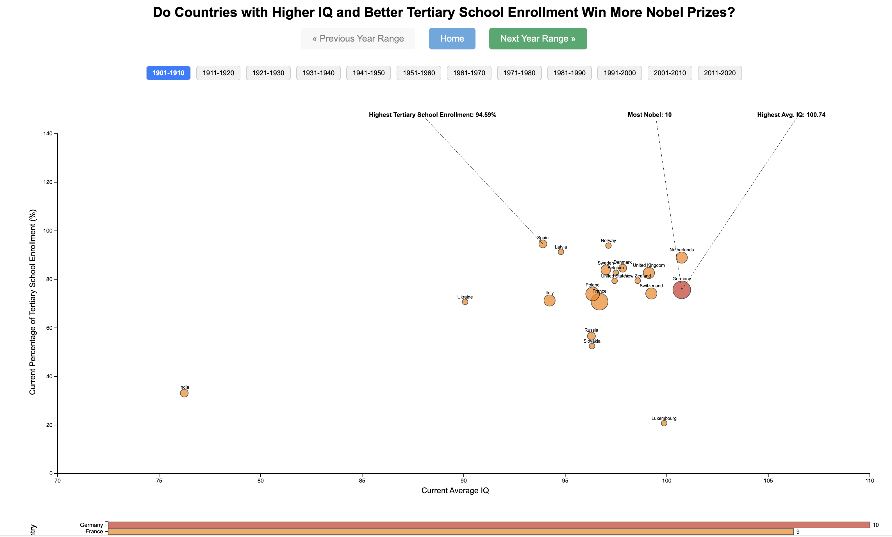

## Nobel Prize, IQ, and Education Visualization

### Project Overview

This project is an interactive narrative visualization that explores the correlation between a country's average IQ, tertiary school enrollment percentage, and its success in winning Nobel Prizes. The visualization aims to uncover patterns and trends that might indicate whether higher education and intelligence levels contribute significantly to global recognition through Nobel achievements. The data spans from 1901 to 2020, allowing users to explore these factors over more than a century.

*This visualization was created as the final project for CS416: Data Visualization.*

### Structure of the Visualization

The project is divided into three main scenes:

1. **Introduction and Narrative (Scene 1)**
   - Provides an overview of the visualization's objectives.
   - Explains the relationship between average IQ, tertiary school enrollment, and Nobel Prizes.
   - Offers navigation instructions and key features of the visualization.

2. **Scatterplot View (Scene 2)**
   - Displays the correlation between countries' average IQ (x-axis), tertiary school enrollment percentage (y-axis), and the number of Nobel Prizes won (bubble size).
   - Includes interactive elements like tooltips and annotations to highlight key data points.

3. **Bar Chart View (Scene 3)**
   - Shows the cumulative number of Nobel Prizes won by each country over time.
   - Complements the scatterplot by providing a historical perspective on Nobel Prize achievements.

### Screenshot

### Data Sources

The data used in this visualization comes from various sources, including:
- [Nobel Prize data](https://www.kaggle.com/datasets/nobelfoundation/nobel-laureates)
- [Average IQ scores by country](https://worldpopulationreview.com/country-rankings/smartest-countries)
- [Tertiary school enrollment percentages](https://data.worldbank.org/indicator/SE.TER.ENRR?most_recent_value_desc=true)

### Features

- **Interactive Year Range Filter**: Users can select different year ranges to see how the data evolves over time.
- **Navigation Buttons**: Allow users to move between year ranges and scenes. Includes "Previous Year Range," "Next Year Range," and "Home" buttons.
- **Tooltips and Annotations**: Provide detailed information on hover, including country names, IQ scores, education percentages, and Nobel counts.
- **Visual Cues**: Interactive elements like the bolding of chart borders on hover, color-coded buttons, and selected year range highlighting improve usability and navigation.

### How to Use

1. **Start with Scene 1**: Read the introductory narrative to understand the purpose and structure of the visualization.
2. **Explore the Data**: Use the year range filter and navigation buttons to explore different time periods and data points in the Scatterplot View and Bar Chart View.
3. **Hover for Details**: Hover over data points to see detailed information in tooltips.
4. **Return to Home**: Use the "Home" button to return to the introductory scene at any time.

### Technical Implementation

The project uses:
- **D3.js**: For creating the interactive scatterplot and bar chart.
- **HTML/CSS**: For structuring and styling the pages.
- **JavaScript**: For handling interactivity, including year range filtering and scene navigation.